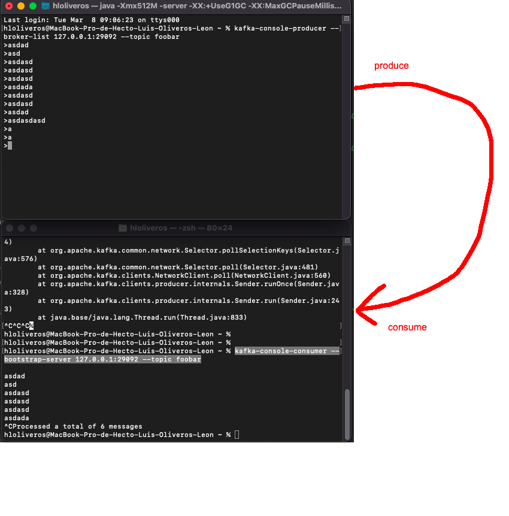
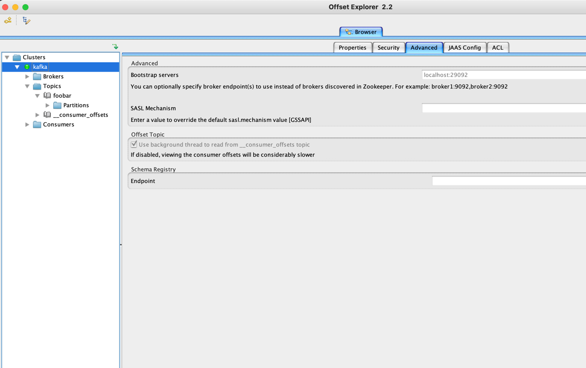

### Description:
Allows running a local instance of kafka using docker


### Run


```bash
docker-compose up
```

### Test:

Run the producer
```bash
kafka-console-producer --broker-list 127.0.0.1:29092 --topic foobar
```

Run the consumer
```bash
kafka-console-consumer --bootstrap-server 127.0.0.1:29092 --topic foobar
```

Image:



You can use Offset Explorer (Kafka Tool). Download it from here: [https://kafkatool.com/download.html]()

You need to go to "Advanced" and write the "bootstrap servers" field as "localhost:29092"




Note: To install the kafka-console-producer and kafka-console-consumer you need to install kafka first.

In macOS:

```bash
brew install kafka
```